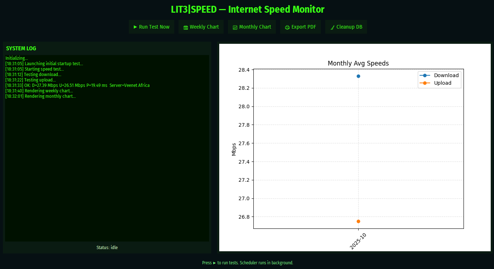

# 📡 Internet Speed Monitor Dashboard

A modern Python desktop application that automatically monitors your internet speed, stores results in an SQLite database, and visualizes weekly performance using interactive charts.

---

## 📌 Features

- ✅ Manual Speed Test (Download, Upload, Ping)
- ✅ Automatic internet speed monitoring every 3 hours
- ✅ Weekly trend visualization chart
- ✅ SQLite database — stores server name & country
- ✅ Tracks failed tests to detect outages
- ✅ GUI with real-time logs
- ✅ Database cleanup for old records

---

## 🧱 Tech Stack

| Component | Technology |
|----------|------------|
| UI | Tkinter + ttk |
| Speed Test | speedtest-cli |
| Database | SQLite3 |
| Visualization | matplotlib |
| Scheduler | schedule |
| Async + Threads | asyncio + threading |

---

## Application Screenshots


### Dashboard UI


### Weekly Trend Chart


---

## 🗂 Project Structure

```plaintext
📦 internet-speed-monitor
│
├── main.py               # Main Tkinter GUI application
├── db_config.py          # Database handling + migrations
├── speed_test.db         # Auto-created SQLite database
├── README.md             # Project documentation
└── requirements.txt      # Python dependencies
